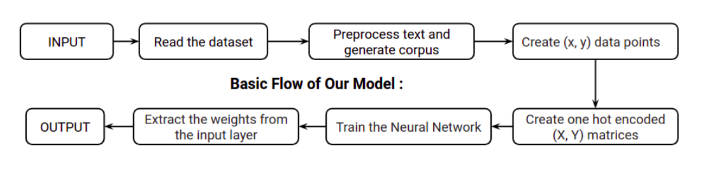
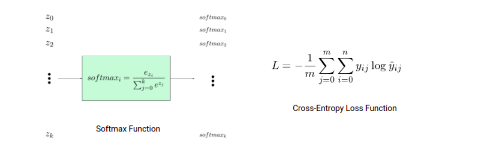

# Word2Vec-Word-Embedding-

This is my try at implementing Word2Vec word embeddings using One hot encoding vectors(CBOG) using Softmax Activation function, Cross-Entropy loss function and Adam optimizer

**Technologies used** - Keras and TensorFlow and Numpy

**Dataset** - Large Movie Review Dataset(IMDB) from Stanford. The data includes movie reviews along with
their associated binary sentiment polarity labels. The core dataset contains 50,000 reviews split
evenly into 25k train and 25k test sets. The overall distribution of labels is balanced (25k pos and
25k neg).

## Preface 
Before we talk about the model to implement that, we need to understand the meaning of Word
Embedding. Word embedding is the collective name for a set of language modeling and feature
learning techniques in natural language processing (NLP) where words or phrases from the
vocabulary are mapped to vectors of real numbers. One common way of measuring this similarity
is to use the cosine of the angle between the vectors. For example, words like “mom” and “dad”
should be closer together than the words “mom” and “ketchup” or “dad” and “butter”.
Word embeddings are created using a neural network with one input layer, one hidden layer and
one output layer

# Model Architecture 

